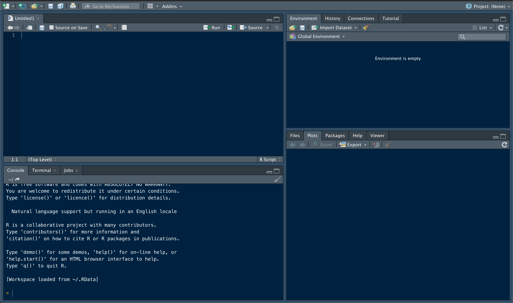

```{r setup, include=FALSE}
knitr::opts_chunk$set(echo = TRUE, collapse = TRUE)
```

# Introduction to the R Environment & Syntax

This first section will introduce the basic elements and components of R Studio, as well as begin to shape your understanding of R syntax and how it can be used to examine and manipulate data.

R is a coding language. Technically you can do everything you need in the terminal window. However, this is not only challenging, but can limit the scope of what's possible with R. R Studio is a graphical user interface (GUI) that allows you to simultaneously write R scripts, keep track of variables and data objects you've created, and visualize your data. It also has a built in support structure, complete with help pages and tutorials.

R can be downloaded [**here**](https://cloud.r-project.org).\
R Studio can be downloaded [**here**](https://rstudio.com/products/rstudio/). Download the open-source Desktop version.

You will need both installed before continuing with these activities. This tutorial will provide both examples of lines of code and their output, as well as prompts for you to write code yourself. It will be helpful to "code along" and replicate all of the provided examples as we go.

## The R Studio Workspace



An R Studio window has four major components. The Console window, in the lower left quadrant, is used for the direct input of commands. This is a direct link to your computer and R functionality. It can be used for testing code or running quick calculations. It's also useful for examining the contents of data structures. It's not very efficient for creating and storing variables and commands though. For this, we will rely on a document called a 'script' (shown here in the top left quadrant) Make sure you have a new script open as we move through these exercises (you can create a blank script using the 'new file' icon in the top left corner of R Studio). The ability to open, edit, and run R scripts in R Studio is one of the biggest advantages of using the GUI. These scripts are used to write and record commands, providing a written record of everything you do to get from raw data to final product. This in turn makes your analyses easier to repeat. Functional and logical R scripts are an important component of many open science ventures.

The R Studio environment also provides easy access to other important details. The Files, Plots, Packages, and the Help windows share a space in R Studio (lower right quadrant). The Files window shows you the files in your working directory, and can be used to access data. The Plots window is where graphical outputs will show up. The range of things you can do with R is greatly expanded by packages (essentially, your R toolbox). These contain functions for diverse applications, and can be used to customize your R experience. The Packages window shows which packages have been installed, and which are currently active. This area can also be used to find and install new packages. We will install several important packages later on. The Help window is relatively self-explanatory. Functions and packages come with documentation, which can be accessed via the Help window. You can use the search bar in that window, or simply type '?function_name()' into the console.

The final area of an R Studio workspace contains the Environment and History windows. Your Environment window will show you all of the variables and data objects you've generated. The History window records all of your actions. This can be useful if you want to trace your steps backwards through an analysis to confirm what you did or identify an issue.

The arrangement of these windows and general appearance of the GUI is customizable in Preferences/Settings.

## Basics of R syntax - Here be dRagons

Your interaction with R is based on commands. Remember, R is a computer language. Despite all efforts to make it as user friendly as possible, it can neither fully anticipate your needs nor infer your intentions. Correct syntax and usage of commands is therefore of utmost importance (and where 99% of the frustration with coding will lie).

R recognizes three types of commands. Elementary commands are fairly intuitive. These include things like basic mathematical expressions and variable assignment. Remember, commands can be input into either the Console or the R script. Commands in the Console will run automatically after hitting the 'enter'/'return' key. There are several ways to run a command contained in a script. The "Run" button in the top right section of the script window will run the current line or all lines selected. The "Source" button will run the entire script. There are also system-specific keyboard shortcuts to run a line of code; 'command + return' on a Mac, for example. It will be helpful to find the shortcut for whichever system you're using. After running code in the script window, results will show up in the console window. Practice entering and running the following elementary commands in both windows.

```{r collapse = TRUE}
1 + 1  
```

```{r collapse = TRUE}
2 - 1  
```

```{r collapse = TRUE}
12 * 2  

```

Note that input of an expression without assignment (using an '=') prints the result in the console window, but does not store the value (you can see what you've stored in the Environment window). In order to store values, you need to assign them to a variable. A variable can be single characters (ex - A, B, X, Y) or strings of characters (ex - key_values, LD50, data.set). Variable names cannot, however, start with a number. We'll go over assignment to variables in greater detail in a later section, but for now try assigning a few variables.

```{r collapse = TRUE}
variable = 1

print(variable)
```

```{r collapse = TRUE}
variable = 3 + 5

print(variable)
```

Note: In the above examples, we use print() to see the content of a variable. You can also see what a variable just by running the variable by itself, but it's a good idea to use a command like print() so you know that you didn't lose any code from that line.

```{r}
print(variable)

#Prints the same thing
variable 
```

The real power of R is in the use of function commands. Functions tell R to do a series of operations, which can include other mathematical functions (find the mean, the standard deviation, etc.), or more complex actions (estimate linear regressions, make plots, etc.). These functions follow a basic syntax of FUNCTION(parameters and values).

```{r collapse = TRUE}
mean(c(1, 14, 10, 6, 2, 2, 9))
```

Remember, R cannot 'infer' the end of incomplete commands. R can tell you when it thinks a command is incomplete though; incorrect syntax will return an error or will return a line that starts with + rather than \> in the console window. For example, try running the previous line of code without the last parenthesis. You can 'complete' the line of code by entering the missing closing parenthesis in the Console window. 'Control + c' can also be used to abort an incomplete command.

## Golden Rule of R - Do unto yourself as others would have you do unto them

As we move through these workshop sessions, there is one key thing to keep in mind. This what we'll call the Golden Rule of R: **Be kind to yourself**. Developing good habits early on is critical!

Obviously the longer you use R, the more functions you'll come across (the collector's curve will never saturate). Keep track of particularly important or useful commands. It can be helpful to maintain a separate document with these commands and what they do (think of this as a personalized diction-R-y). This is something you can refer back to often, rather than needing to search through large volumes of old scripts for a specific line of code. This can be tedious, and depends a lot on personal preference. You might want to keep track of just the functions that give you trouble, or that you can't ever seem to remember. You will develop a sense of what is most useful for you as you spend more time coding.

A comprehensive repository is less useful for variables, as even relatively simple processes in R can generate dozens of them. Keeping track of all of them in one place would be tiresome and inefficient. You still need to keep track of what you're creating (and why) though. There are two good habits that will help with this. First, develop a standard naming structure for your variables. Names should be both concise and descriptive. For instance, imagine you're creating a model describing the relationship between X and Y, and want to store the model as a variable. Assigning it to a variable called 'model_describing_the_relationship_between_X\_and_Y' is fairly descriptive, but way too long. A variable called 'model' is short, but not descriptive. Variables like 'X_Y.model' are typically a good compromise. However you decide to name variables, be consistent for different types of objects across your scripts. If you use 'X_Y.model' in one script, use 'A_B.model' rather than 'AB_model' for the next model. These stylistic conventions are usually based on personal preference, and should be something you include in your dictionary.

It's also important that variable names be relatively unique: You want to avoid using the same variable name across many different scripts. For example, using a variable called "data" to store your data in all of your scripts is an easy way to get your analyses tangled up, especially if you're jumping between different R scripts in the same session. **Assigned variables are not stored in your script**. So, if you assign something to 'X_data' in one script, it will carry that over into any other script you open during that session. Likewise, if you re-assign 'X_data' in the second script and then go back to the first script, 'X_data' won't change back.

Finally, remember that R is case sensitive; 'Variable' is not the same thing as 'variable' in R. Despite the scientific convention (e.g. - The 't' vs. 'T' variables for time and temperature), it's usually not a good idea to differentiate variables based soley on capitalization. Remember that the goal is to be both concise and descriptive - name your variables 'time' and 'temp', not 't' and 'T'.

The second (and more important) helpful habit is to comment on everything! While a separate document for important code/variables can be useful for general R purposes, it will not help you remember the purpose, organization, or workflow of an individual script. For this, we rely on in-script annotation. Characters following a \# are not executed by R. These are called comments, and are absolutely essential for long-term success in R. You should be able to open up an R script and know exactly what every line is supposed to do. Get into the habit of commenting on your scripts. Comment such that someone completely unfamiliar with your script could open it and know exactly what's happening in every line. Do not fall into the classic trap of thinking "this is an easy step, I'll totally remember what it's doing" because it's not and you won't.

Developing your own individual coding style is part of learning R, and will most likely help make it more intuitive and enjoyable. However, it will save you a lot of time and energy (and tears) if you make sure that your individual style is built on a foundation of good habits. Name data objects in consistent ways. Capitalize names in a consistent way within and across all your scripts. Use the same indentation strategies. Comment on everything. Developing smart coding habits early on is much easier than trying to break bad habits later.

Note: Many analyses require coordination between multiple R scripts. It might also just make more sense to break a long script into multiple shorter scripts. Keeping collections of R scripts organized and functional is best accomplished using something called an R Project. We will cover these later, but you can find some information on their uses and structuring [**here**](https://support.rstudio.com/hc/en-us/articles/200526207-Using-Projects) and [**here**](https://nicercode.github.io/blog/2013-04-05-projects/) if you're interested.

# Basics of Data Manipulation

R's main functionality is the manipulation of data. But before we can get into processing and analyzing data, we need to go over how data is structured in the R environment. Different types of data objects have their own set of unique properties, characteristics, and structures which are fundamental to their manipulation in R. Herein lies a major source of frustration for novice (and experienced) R users.

## Variable Assignment

We've already mentioned that assignment to variables stores information in R. This is true for any of the data structures we'll talk about. You can assign information in two main ways, with '=' or with '\<-'. In general, these are equivalent methods of assignment. Try assigning a variable using both methods.

Note that 'x -\> 1' is not the same thing as 'x \<- 1'.

```{r collapse = TRUE, error = TRUE, message = FALSE}
x = 1
y <- 2
z -> 3

print(x)

print(y)

print(z)
```

Variables can be used to store more than just numbers though. Variables can store a wide-variety of data objects. This includes characters (or strings of characters). It's important to use quotation marks when assigning characters to a variable (this prevents the assignment of previously assigned numerical values on accident). Remember, R cannot infer your intentions.

```{r collapse = TRUE}
beta = x
print(beta)

alpha = "x"
print(alpha)
```

## Vectors

Vectors are ordered collections of either numbers or characters. These are one dimensional data structures, meaning their structure is defined by a length; every value occupies a specific position in the vector. Position 1 is the first value, position 2 is the second, etc. etc.

Vectors can be created manually using the concatenate function, c(). This works for both individual values, character strings, and even other vectors. This function essentially binds objects together in a specific order. You can mix-and-match values and variables when concatenating.

```{r collapse = TRUE}
x = c(1,2,3)
y = c(4,5,6)
print(x)

#Notice that we have now overwritten the original values assigned to x and y

z = c(y,x)
print(z)

#Notice that the order in which values were assigned depends on both
#the order of the vectors and the order of values within the vectors
	
A = "red fish"
B = "blue fish"

pond = c(A, B, "one fish", "two fish")
print(pond)
```

The concatenate function is a simple way to create short vectors, but longer objects can be tedious to input in this manner. There are more efficient ways to create vectors if you'd like them to contain simple sequences or patterns of numbers.

For instance, you can create a vector with all integers between two numbers by putting a ':' between them. Note that order matters.

```{r collapse=TRUE}
forward = c(1:10)
reverse = c(10:1)

print(forward)
print(reverse)
```

This is the equivalent of: c(1, 2, 3, 4, 5, 6, 7, 8, 9, 10) or c(10, 9, 8, 7, 6, 5, 4, 3, 2, 1), but requires a fraction of the number of keystrokes.

### seq() and rep()

The functions seq() and rep() can generate more complex patterns. The seq() function can be used to define a sequence of values based on the desired start and stop values, as well as the interval between values. Note that if a different interval size is not specified, the function defaults to a value of 1, and this command produces the same thing as you'd get by using a ':'.

```{r collapse=TRUE}
sequence = seq(from = 3, to = 15)
print(sequence)

new_sequence = seq(from = 0, to = 15, by = 3)
print(new_sequence)
```

If you'd like to build a vector based on the repetition of values, rep() can be used. The vector is formed based on an input (specified as 'x') and a desired number of times to repeat that input.

```{r collapse=TRUE}
repetition = rep(x = 7, times = 8)
print(repetition)

rep = rep(x = "rep", times = 10)
print(rep)

x_rep = rep(x = x, times = 4)
print(x_rep)
```

Another useful parameter for the rep() function is "each", which tells R how many times to repeat each value **within** the repetition. By manipulating 'times' and 'each', you can create vectors which would otherwise take a lot of time to assemble manually.

```{r}
new_rep = rep(z, times = 4, each = 1)
print(new_rep)

single_rep = rep(z, times = 1, each = 4)
print(single_rep)
```

### Vector Arithmetic

One of the other useful vector characteristics is that once you've generated a vector, it can easily be used in arithmetic and mathematical functions.

```{r collapse=TRUE}
print(z)

z + z 
```

Notice how the vectors were added together. **Vector expressions are site specific**: z1 + z1, z2 + z2, etc. However, if the vector lengths don't match, the shorter vector gets recycled.

```{r collapse=TRUE}
m = c(1,2,1)
z + m

z + 6 #Essentially a vector of length 1
```

### Summarizing Vectors

Vectors are commonly used to store numerical measurements or sample data. It's therefore useful to be able to summarize them in various ways. There are many functions to do this with, most of which are fairly intuitive. For example, asking for the max() of a vector will return the maximum value contained in the vector.

```{r collapse=TRUE}
print(z)

max(z)
```

Other common summary functions are min(), mean(), and median(). It is often also useful to find the length of a vector.

```{r collapse=TRUE}
print(z)
length(z)

print(m)
length(m)
```

Other functions output more complex results. The range() function returns two numbers at the same time, the maximum and the minimum values. This presents a new challenge. If you wanted to use these numbers for further analysis, you will need to be able to isolate them or specify which you want to use. This is where understanding the structure of the data object becomes important.

Assign the range of 'z' to a variable. Print that variable. What do you see? Using str() will return a compact summary of the structure of an object. Use str() to examine both z and your new variable. Don't forget that your variable name should be both concise and informative!

Both objects are vectors. Remember that because vectors are one-dimensional data objects (the structure is defined by a length), the values contained within them can be identified by their positions. Calling up specific values from a vector simply requires specifying the position of the value(s). This is done using '\[ \]', and is the first example of a process called subsetting. This is one of the most useful skills in R, especially once we start dealing with larger, multi-dimensional data structures.

```{r collapse=TRUE}
print(z)

#Print the second position in vector z
print(z[2])

#Remember how we can specify sequences of numbers using ':'
print(z[2:4])
```

Here's your first multi-step problem: Assign just the maximum value of 'z' to a new variable by subsetting the range variable you previously created. Things to keep in mind: Are your variable names short but informative? Have you been commenting on your script? What would be a more efficient way of doing this?

The functions we've dealt with so far work with ordered (ex - vectors that are arranged from smallest to largest) and non-ordered vectors. However, some functions or manipulations require that vector inputs are ordered. This can be accomplished using the function sort(). This function will re-arrange values within a vector from smallest to largest. How could you use sort() and length() to find the maximum value of a vector? As you can see, for any analysis in R, there can be many potential solutions. For the simple question "what is the maximum value contained in vector z", for example, we've already covered three possible solutions of varying complexity. The best solution will often be context-specific, but ultimately, if your solution works, it is a correct solution.

```{r collapse=TRUE}
print(z)

sort(z)
```

### Challenge: Can you use sort() to arrange a vector from largest to smallest instead?

There are several ways to do this. Be creative!

## Data Classes

Up to this point we've mostly dealt with data comprised of numbers or characters. R handles several different types of data though, which is why it's such a powerful tool.

### Integers, Numerics, and Characters

Integer and Numeric data are both comprised of number values. Integers cannot have decimals while numerics can.

Character data is non-numeric. Letters or words are (usually) automatically stored as character data. Numbers can also be stored as characters too, but will lose their numeric properties.

```{r collapse=TRUE, error = TRUE}
num = c(14, 22, 30, 38)
num + num

char = c("14", "22", "30", "38")
char + char
```

### Factors

Factors identify discrete classifications (i.e. - categorical variables), and tells R it's dealing with unique groups of data. The different groups of factors are called 'levels'. These levels don't have inherent meaning, other than to delineate data into groups. Factors can be identified by numbers or character data. Remember though, when a number is classified as a factor, it loses its numerical characteristics (you can't add factors together, for example). We will talk about factors when we cover more complex analyses and data visualization, but common examples include experimental groups (control vs. treatment), descriptive characteristics (colour, population of origin, etc.), and other similar grouping information.

### Logical Data

Logical data is a little different, and characterizes values based on whether they satisfy some logical statement. Logical data is therefore reported as True/False. There is a specific R syntax to define these statements. '==' is used to indicate an exact equality is required. **This is not the same as '='**. An exact equality is read as "is exactly equal to". Looking for values that are not equal to a given value is accomplished with '!=', the syntax for an inequality (AKA "is not equal to"). These logical statements can be evaluated for single values or for vectors. Pay particular attention to the output of using a logical evaluator on a vector.

```{r collapse=TRUE}
value = 4

#Evaluates the statement "value is exactly equal to 3"
value == 3

print(z)
z == 4

#Evaluates the statement "which positions in vector z are not equal to 3"
z != 3
```

Other common logical statements are '\<' ("less than but not equal to"); '\>' ("greater than but not equal to"); '\<=' ("less than or equal to"); and '\>=' ("greater than or equal to"). Remember that'\<-' is used to assign values, whereas '\<=' is used to evaluate logical statements.

```{r collapse=TRUE}
print(value)

value > 3

print(z)

z >= 2
```

Evaluating logical statements becomes increasingly important when dealing with large data sets. There are several other logical evaluators or modifiers that we will examine when we cover subsetting data in more detail.

Missing values may be common in data sets, and constitute their own form of logical data. These can be represented in R using NA, which stands for 'Not Available'.

TRUE, FALSE, NA, and a few other values are exceptions to the rule that characters need to be input surrounded by quotation marks, since they're interpretted as logical data, not character data. These characters are so fundamental to the operation of R that it recognizes them without quotation marks (remember this when assigning variable names!). In some cases, R also will recognize abbreviations of these values. Test this by assigning "T" and T to a variable and printing the variables.

### Combining Data Classes

Using the function class() is a simple method to determine what type of data an object contains. Check the type of data contained in 'z'. What type of data is contained within the variable 'pond', which you assigned early on in this tutorial. One important thing to note, vectors can only contain one type of data. You cannot use a vector to store both numeric data and character data, for example. It will change all values to characters if you try to do this.

```{r}
combo = c(z, pond)

print(combo)

class(combo)
```

The exception to this rule is when a vector contains 'NA' (and certain other logical values), in which case the vector retains the class of the non-missing values.

```{r}
missing_z = z

#Replaces the 4th position of missing_z with NA
missing_z[4] = NA

print(missing_z)

class(missing_z)
```

The exception to this exception is when TRUE and FALSE are included alongside numeric data. In that case, the logical values are converted to binary data (1 = TRUE, 0 = FALSE), rather than maintained as logical data.

```{r}
false_z = z
print(false_z)

false_z[2] = FALSE
print(false_z)
```

Sometimes it's necessary to modify the class of data values. This is known as coercion. The functions as.character(), as.numeric(), as.integer(), and as.factor() are commonly used to force data into character, numeric, integer, and factor classes, respectively.

```{r collapse= TRUE}
z.char = as.character(z)
print(z.char)

z.int = as.integer(z.char)
print(z.int)
```

## Creating Data Objects

One of the most critical requirements towards R literacy is the ability to generate data structures. Empty vectors can be created for numeric/integer and character data using numeric() and character(), respectively. An empty vector for data classified as logical is created with vector(). Empty vectors can be assigned any type of data though, which will often override the original data class. We will talk about an important exception below. Remember, objects you create are not stored unless they are assigned to a variable!

```{r}
N = numeric()
C = character()
V = vector()

class(N)
class(C)
class(V)
```

Let's see what happens when you try to assign a character to a position in a numeric vector.

```{r}
class(N)
N[3] = "character" #this specifies that the third position in the 
                   #vector N is equal to the character string “character”. 
class(N)
```

Notice how the original class for N has changed to match the class of what was added. If we add a numeric value to N now what will happen?

```{r}
N[6] = 15 #this specifies that the sixth position in the vector N is equal 
          #to the number 15. 

class(N)
```

Even though we added a number to vector N, because it already contains a character string, and is a character-classed vector, R automatically converts the numeric input to a character. This illustrates the important exception mentioned before: Vectors classed as character data coerce any input to character data. This is a common issue when working with experimental data - units or unrecognized NA filler variables can often force data from numeric to character class. This is also applies to empty character vectors.

```{r}
class(C)

C[3] = 4
print(C)

class(C)

C[5] = TRUE
print(C)

class(C)
```

## Multi-Dimensional Data Structures

Like vectors (one-dimensional structures defined by a length), the other common data structures can be defined by different numbers of dimensions. A matrix is a two-dimensional object (defined by a length and a width, aka some number of rows and columns). An array is an n-dimensional object. For example, a three-dimensional array is commonly thought of as a cube, defined by some number of rows and columns replicated across some number of sheets.

When creating an matrix or array, you need to specify the dimensions. Matrices are formed using the function matrix(nrow = X, ncol = Y). Arrays follow a slightly different format: array(dim = c(rows, columns, sheets)).

```{r}
mat = matrix(nrow = 5, ncol = 3)
print(mat)

arr = array(dim = c(3,4,3))
print(arr)
```

Data frames are matrix-like data structures, in that they're two-dimensional. The key difference is that matrices are restricted to one class of data, while data frames can contain columns of different data classes. Data frames are therefore extremely useful as an intuitive way to record results of experiments and are the most common data structure we'll work with. While a data frame can contain columns with different classes of data, all columns must be of the same length within the data frame, and data class can't vary within a column (again, with the exceptions outlined above).

Matrices can easily be converted into data frames using the as.data.frame() function.

```{r}
print(mat)

dat = as.data.frame(mat)
print(dat)
```

Notice that the column names change as the structure is converted from matrix to data frame. The row numbers also change slightly in their format. There are other differences between matrices and data frames that we won't cover yet.

## Subsetting Data Structures

Now that we've covered common data structures, it's time to re-visit subsetting. Data sets can be quite large in R, and being able to efficiently and accurately pull out particular records or observations is critical for many analyses. Since data sets are rarely sorted in a way to makes this easily accomplished manually, you will have to rely on subsetting. The syntax of subsetting can be tricky to wrap your head around, but just keep the **structure** of the data in mind.

### Positional Subsetting

We already worked with subsetting vectors. These one-dimensional structures are subset by specifying the specific position of values you want. Matrices and data frames can be subset in a similar way, but now you're dealing with two-dimensional structures. You need to specify both a row and a column (in that order) to locate a specific value, again using \[\] to contain this position information.

```{r}
#This time we add a little data when we create the matrix
dat_matrix = matrix(nrow = 8, ncol = 4, data = 1:(8*4))
print(dat_matrix)

dat_matrix[7,3] #Pulls out the value in row 7, column 3
```

Positional subsetting can also use more complex information to locate data. For example, let's say you wanted every other value from the third column. There are several ways to do this, other than manually inputting the numeric position of each number.

```{r}
print(dat_matrix)
#Approach 1 - Using c()
c_positions = c(1,3,5,7) #Manually input positions into a vector
print(c_positions)

dat_matrix[c_positions, 3] #Use the vector to specify rows you want from column 3

#Approach 2 - Using seq()
seq_positions = seq(from = 1, to = 8, by = 2)
print(seq_positions)

dat_matrix[seq_positions, 3]

#Approach 3 - Using vector arithmetic
arith_positions = (2 * 1:(8/2)) - 1 
#Starts off with a vector that is half as long as the column, 
#multiplies those numbers by two, then subtracts one
print(arith_positions)

dat_matrix[arith_positions, 3]
```

Obviously, some approaches are more intuitive than others. But different situations may require different things, so it's a good idea to keep an open mind.

What if you want to call an entire row or column? Again there are several ways to do this, but R has provided a shortcut: Leave either the row or column value empty.

```{r}
print(dat_matrix)

dat_matrix[,3] #Specifying a column, but not a row calls up the entire column

dat_matrix[2,] #Specifying a row, but not a column calls up the entire row
```

Positional subsetting can also be used to **exclude** values from a vector or matrix. Exclusive subsetting return all values except those in specified positions. Observe what happens when you include a '-' when subsetting based on the previously defined positions.

```{r}
print(dat_matrix)

dat_matrix[seq_positions, 3]

dat_matrix[-seq_positions, 3]
```

When you're defining specific positions to exclude, parentheses are important: -1:5 is not the same as -(1:5).

```{r error= T}
print(dat_matrix)

dat_matrix[-(1:5),1]

dat_matrix[-1:5,1]
```

NOTE: If you're storing data after an exclusive subset, make sure you're assigning it to a new variable, not overwriting the old variable. If you're not careful, exclusive subsetting is an easy way to lose data.

```{r}
#If you use just re-assign to the same variable...
excl_matrix = dat_matrix
print(excl_matrix)

excl_matrix = excl_matrix[-(1:2),] #Removes the first two rows
print(excl_matrix)

#If you accidentally run that line of code again, you'll lose ANOTHER two rows
excl_matrix = excl_matrix[-(1:2),] 
print(excl_matrix)
```

```{r}
#If you use a new variable name...
excl_matrix = dat_matrix
print(excl_matrix)

next_matrix = excl_matrix[-(1:2),] #Removes the first row
print(next_matrix)

#Now if you accidentally run the line, you've still got all the data you wanted
next_matrix = excl_matrix[-(1:2),]
print(next_matrix)
```

In many cases rather than removing data from specific positions, it's usually a better idea to call data that fulfills some requirement. This also has the benefit of working when you don't know the exact positions of wanted vs. unwanted data. This is called logical subsetting, since it's based on the evaluation of logical statements. Buckle up, this is where the syntax can get a little weird.

### Logical Subsetting

Logical subsetting will return values that result in a TRUE evaluation of the logical statement.

```{r}
print(dat_matrix)

dat_matrix[,1] > 3

dat_matrix[dat_matrix[,1] > 3, 1]
```

Let's break that syntax down. Remember, subsetting matrices requires identifying positions based on rows and columns. In the above expression, you're using the logical statement 'dat_matrix\[,1\] \> 3' instead of specifying row numbers: The positions in the first column that satisfy the logical statement are used as a substitute for row numbers. As your data sets get more complex, logical subsetting becomes more and more useful, as it allows you to subset without needing to know the exact positions of the desired data.

**Check Point**: What type of data structure is produced by the subsets we've shown so far?

The final utility of logical subsets we'll cover for matrices is creating a new matrix by selecting entire rows or columns in an existing matrix. We've already talked about how to call an entire row or column in a matrix (just leave out the column or row position, respectively). We can combine this syntax with a logical subset to pull entire rows or columns that fulfill the logical statement.

```{r}
print(dat_matrix)

dat_matrix[,1] > 3

dat_matrix[dat_matrix[,1] > 3 ,] #Note: no column position specified

#You're not restricted to just evaluating the first column either
dat_matrix[,3] <= 20

dat_matrix[dat_matrix[,3] <= 20 ,] 
```

Again, let's break down that syntax. The first logical subset pulls the entire row when the value in the column 1 position is greater than, but not equal to, 3. The second subset pulls any row where the value in the column 3 position is less than or equal to 20. Subsets like this can be confusing because it looks like you're specifying rows to pull based on a column. Just keep the structure of the data object in mind. Sometimes it's useful to remember that the length of a column is equal to the number of rows, and vice versa. Specifying a position in a column is the same as specifying a row number.

### Subsetting Dataframes

Data frames can be subset in all the same ways as matrices. There is an additional method of subsetting that is specific to data frames though that is extremely useful. Remember that when we converted from a matrix into a data frame the main difference was the data frame had column names, while the matrix did not. These column names can be used to subset by specifying dataframe\$name.

```{r}
print(dat_matrix)

matrix_df = as.data.frame(dat_matrix)
print(matrix_df) #Columns have been named V1 though V4

matrix_df$V3

subset_df = matrix_df[matrix_df$V2 > 14,] #Calls any row where the V2 value 
                                          #is greater than 14
```

One other nice feature of working with data frames is that it's easy to create new columns, just by specifying them as dataframe\$new_column. If you specify a column that does not exist, R will create a new column with that name.

```{r}
matrix_df

matrix_df$colour = rep(c("Red", "Blue"), times = 4)
matrix_df

red_df = matrix_df[matrix_df$colour == "Red",]
red_df
```

You can also subset based on multiple logical statements. This is possible in both matrices and data frames, but the use of column names tends to help keep the statements from getting to be too confusing. There are a couple of these types of modifiers to logical statements. The modifier '&' is perhaps the most common, and specifies positions that fulfil condition 1 AND condition 2. We will cover other modifiers in later exercises.

```{r}
matrix_df

#Note that different logical evaluators are NOT separated by commas
double_sub = matrix_df[matrix_df$colour == "Blue" & matrix_df$V2 > 12,]

double_sub
```

## Importing data

Most of the time, data won't be generated internally. Instead, files containing the data will need to be imported into the R environment. There are several tools to accomplish this. The easiest is to use the "Import Dataset" drop-down menu in the Environment window. This will allow you to select data sets in different formats to import. Pro tip: you can copy and paste the generated code sample into your script for easy access later!

Sometimes data sets need to be imported manually, either because additional details need to be specified or because the data format is not supported by the "Import Dataset" tool. This is especially common when working with more complex data (ex - satellite data or DNA sequences). There are several functions that can be used to import data in those formats, but because they are often highly specific to the type of data, we won't cover them here.

The most important step before importing data is to set your working directory. This will tell R where to look for files. You can see what files R can "see" in the Files window (lower right quadrant). Remember, R cannot infer intentions; without the correct file path you cannot import data. You can set your working directory using the function setwd("file_path").

Tip: If you're not exactly sure of the file path, it's safest to use tab to navigate through your local file structure. Type 'setwd("")', and then with your cursor placed inside the quotation marks, hit tab. R should provide a dropdown file tree that you can then use to navigate to the desired directory. In a later tutorial, we will cover the use of R Projects, which simplify this process.

Once you've imported the data, it's always a good idea to check the structure and summary of the object. The summary() function will return a 6-number summary for each column.

This is the end of the first tutorial. Hopefully you're beginning to feel more comfortable with the R interface, and the basics of data structuring and manipulation. The next section will deal with intermediate data manipulation. Later tutorials will focus on methods for summarizing data, common statistical analyses, and data visualization.
