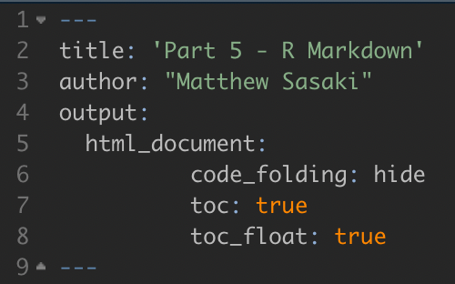

```{r setup, include=FALSE}
knitr::opts_chunk$set(echo = TRUE, collapse = TRUE)

library(tidyverse)
```

One of the best parts of a project is being able to finally share the results of your analyses. At various points throughout the project, you'll probably need to share different components of your analyses (code, visualizations, written reports, etc.) with different people. The traditional process may entail performing your analyses in R, exporting your figures and tables, and then manually inserting them into a word document with the written summary of your results. Alongside this written summary, you will then have to share the underlying code and raw data for those who are interested. For collaborators that don't use R, you will likely have to provide written details on how you processed and analyzed the data, while collaborators who **do** use R might like to see more about the code you used to run the analyses. Helping to create streamlined summaries for a range of audiences, an essential component of our workflow is the R Markdown (.Rmd) file.

# Markdown

After investing time and effort in learning the R coding language, you probably don't want to hear "time to learn another language". Before you close this tutorial though, let me assure you that Markdown is not only simple, but extremely powerful when used with R analyses. Markdown is a simple "markup" language used to format documents. R Markdown integrates R code within this formatting framework, allowing you to more efficiently integrate code, visualizations, and written reports. You might imagine that this would be useful for more than just written reports, and indeed, R Markdown can be used to create a wide variety of outputs, including presentation slides and web pages. 

## Quarto
R Markdown files are fairly specific - it's assumed that the code you integrate into the files is R code. As projects become increasingly multi-lingual though, the ability to run code from other languages (e.g. Python) in these reports becomes increasingly useful. Recently, a new markdown publishing system called [Quarto](https://quarto.org) has provided this capacity. Along with some refined aesthetic capabilities, the ability to run code from languages other than R makes this system worth checking out. Similar to R Markdown, Quarto docs can be used to create a wide range of produces. The website these tutorials are hosted on, for example, were created using Quarto.

# Setting up your R Markdown

In RStudio, a new R Markdown file can be created in the same way as a new script, using the page icon in the top left corner of the window. You'll notice a number of options in the drop-down menu, which can be explored at your leisure. When you create a new Markdown file you'll be presented with a series of fields and options. Title and Author can be filled in as appropriate. You can input a static date, or choose to use the current date each time you knit (i.e. - run the code for) the document. There are three primary outputs for a markdown file: an HTML, PDF, or Word document. Each come with their own advantages, some of which will be explored in this tutorial. Also, don't be overly concerned about what you enter into these fields or which options you select - all of these can be changed using the first key component of the markdown file, the YAML.

## YAML (Yet Another Markup Language)

The YAML appears at the top of markdown files and will set key parameters of the document. Some key components of the YAML are explored below. After so much time working with R syntax, the YAML may appear strange, and almost human-readable. This is by design. However, while these sections are typically easier to read, they are just as sensitive to formatting (if not more so) than R code. If you edit the YAML, you should be careful to follow the indentation levels of the various components.

## Text Formatting

One of the main reasons to use an R Markdown file is Markdown itself - simple text formatting that looks great. The basic components of a markdown doc are:

-   Plain text. Entered just as you would with any word processor.

-   Headings. These are indicated using "\#". Different levels of headings are indicated by different numbers of "\#" (Heading level 1 - #, heading level 2 - ##, heading level 3 - ###, etc.).

-   Bolded and italicized text. To **bold** text, put two asterisks on either end. To *italicize*, use just one asterisk.

-   Other forms of text formatting and customizing the page layout are also possible, with a little more know-how.

## Code Chunks

The other reason R Markdown documents are so powerful is the direct integration of R code.

STILL BEING DEVELOPED

## Inline R Code

In addition to the code chunks, you can run R code right in the main text of an R Markdown document. For example:

> There are currently `r length(dir())` documents in the directory used to create this website. Of those, `r length(which(str_detect(dir(), pattern = ".Rmd")))` are markdown files.

While this reads like normal text, if you were to look at the markdown file, you'd see this:


By including the R code directly in the text like that, the information on the total number of files and the number of R markdown files is kept up to date. This is a powerful tool when paired with the project folder setup. More than just keeping track of the number of files (although this can be useful too), inline code can present updated statistical results (p-values, correlation coefficients, etc.), or descriptions of the findings (which group has the largest trait value, which sampling site has the lowest latitude, etc.). You can't completely automate the results section of a manuscript, but when used carefully, inline code can help you keep your reports and manuscripts up to date!

# Output Formats

## PDF Outputs

STILL BEING DEVELOPED

## Word Documents 

STILL BEING DEVELOPED

## HTML Outputs

As you might have guessed from the format of these tutorial pages, I prefer to knit markdown files to HTML. I find that the formatting is cleaner, and the results are easier to share across systems. As we'll see, there's also a set of features that are unique to HTML outputs that help make these documents far easier to share with a broad audience (coders and non-coders alike), and help them navigate the document. Setting up these features is also incredibly easy, as you can see below (this is the YAML used to produce this document).



### Code Folding

The first of these features is Code Folding. You'll find this specified in the first line of the html_document parameters. Below this chunk of text, you'll notice a small button labelled "Code" and a simple plot. When you click this button, the code used to generate the plot will be revealed. Click it again, and the code folds back up into the unobtrusive button form. This feature is really useful when sending a report to collaborators with varying coding skill/interest levels: for collaborators that don't care to read through the code used to analyze the data, big chunks of code are distracting and confusing; some collaborators care more about the code used than the written descriptions, however, and not providing any access to the code won't help them as much. Code folding allows you to satisfy both parties.

```{r fig.width=4, fig.height=4, fig.align="center"}
#| code-fold: true

random_points = data.frame("id" = c(1:100), 
                           "value" = rnorm(n = 1000, mean = 50, sd = 10)) %>%  
  filter(value < 55)

ggplot(random_points, aes(x = value)) + 
  geom_histogram(binwidth = 1) + 
  theme_bw(base_size = 24) + 
  theme(panel.grid = element_blank())
```

### Table of Contents

Along the right side of this document, you'll find a table of contents. The second line of HTML parameters creates the table of contents (TOC), while the third line specifies that the TOC should 'float' along the left side of the document, no matter where you scroll in the document. The different sections and sub-sections of the TOC are determined by the heading levels used throughout the text (#, ##, ###, or ####). These headings are nested based on the order they are provided (e.g. - \# Section 1, \## Sub-section 1a, \## Sub-section 1b, \### Sub-sub-section 1b-1, \# Section 2, etc.)

### Interactive Tables & Figures

A really powerful HTML feature is the inclusion of interactive tables. Now, rather than having to send collaborators a .csv file with the data alongside your summary, you can include the data in a compact, searchable, filterable table. Note, you might still have to send data in some cases, but this is a good way to facilitate exploration of the data set.

```{r}
#| code-fold: true

library(palmerpenguins)
library(DT)

table_data = palmerpenguins::penguins %>% 
  select(species, island, body_mass_g, sex, year)

datatable(table_data, rownames = FALSE, filter="top", 
          options = list(pageLength = 10, scrollX = T))

```

These tutorials have covered the basics of how R can be used to analyze data, starting with the structure of data, data carpentry, and simple visualizations. We've also covered how R and markdown documents are integrated to help streamline the process of creating rich, informative summaries and reports. These tutorials should provide a firm foundation for you to work from as you begin to analyze your own data. Remember, this is just the beginning of what you can do in R. Hopefully these basic skills will help as you begin to explore the rest of R's capabilities on your own though. 

# Making your own contributions
As you work on further developing your R skills, you might come across topics that would be useful to expand on or include in these tutorials. Here is a great opportunity for you to contribute to the tutorials. The website is hosted on GitHub, just like the data analytic projects we work on, and you should be able to suggest changes using the same pull request approach we've discussed elsewhere on this site. 
